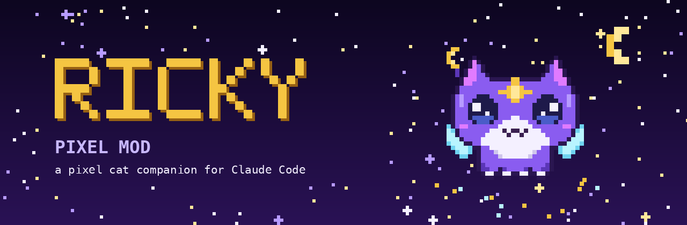
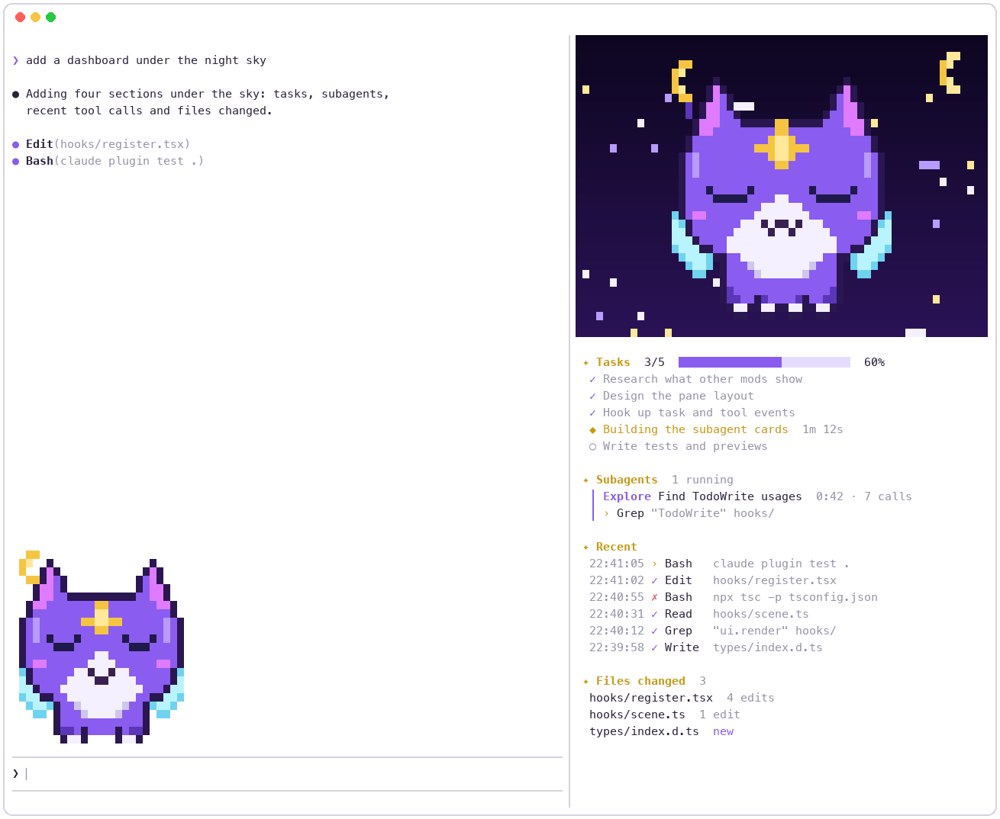
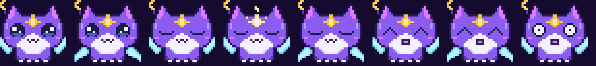

<div align="center">



### A pixel cat that lives in Claude Code — and keeps an eye on your session.

<p>
  <a href="https://code.claude.com/docs/en/plugins/mods/create"></a>
  <a href=".claude-plugin/plugin.json"></a>
  <a href="LICENSE"></a>
  <a href="https://github.com/muxia23/ricky-pixel-mod/stargazers"></a>
</p>

<p>
  <a href="#-quick-start"><b>Quick start</b></a> ·
  <a href="#-features"><b>Features</b></a> ·
  <a href="#-moods"><b>Moods</b></a> ·
  <a href="#%EF%B8%8F-options"><b>Options</b></a> ·
  <a href="#-faq"><b>FAQ</b></a> ·
  <a href="README.md"><b>简体中文</b></a>
</p>



</div>

https://github.com/user-attachments/assets/933e4bd2-e972-463a-98bb-80116958b3dc

<br>

Ricky flies in a twinkling night sky beside your transcript and reacts to everything Claude does: eyes closed and forehead star glowing while it **thinks**, wings flapping and stardust trailing while it **calls tools**, a happy squint when a turn is **done**, and bristling fur when something **fails**. Under the sky, a dashboard shows your tasks, running subagents, recent tool calls and the files you've changed.

## 🚀 Quick start

**1. Clone**

```bash
git clone https://github.com/muxia23/ricky-pixel-mod ~/ricky-pixel-mod
```

**2. Load it** — for one session:

```bash
claude --plugin-dir ~/ricky-pixel-mod
```

or for every session, in `~/.claude/settings.json`:

```json
{ "env": { "CLAUDE_CODE_PLUGIN_DIRS": "~/ricky-pixel-mod" } }
```

**3. Switch to fullscreen rendering** — inside Claude Code, run:

```
/tui fullscreen
```

> [!IMPORTANT]
> The side pane only docks beside the transcript in **fullscreen rendering** with a terminal **110 columns or wider**. In the default renderer it opens above the prompt instead. Claude Code remembers the choice, so you only do this once; `/tui default` switches back.

**4. Say hi** — the pane opens by itself on wide terminals, or any time with `/ricky`.

> [!NOTE]
> Requires Claude Code **2.1.287+** (mods) and a **truecolor** terminal (Ghostty, iTerm2, WezTerm, Kitty, VS Code…).

## ✨ Features

<table>
<tr>
<td width="50%" valign="top">

### 🌌 Night-sky pane
A pixel sky that spans the pane's width, with twinkling stars, a golden crescent moon and a 32×32 Ricky that bobs, blinks and flies.

</td>
<td width="50%" valign="top">

### 📋 Session dashboard
**Tasks** with a progress bar · running **subagents** with what they're doing · the last 6 **tool calls** with ✓ / ✗ · **files changed**. Empty sections stay hidden.

</td>
</tr>
<tr>
<td width="50%" valign="top">

### 🐾 Band above the prompt
A smaller Ricky that flies back and forth trailing stardust while Claude works. It **sizes itself to the room it has** — 24px, 16px, or just the 8px head — so it never gets cut off in a short window.

</td>
<td width="50%" valign="top">

### 💜 Purple-gold theme
The spinner reads *"Ricky is stargazing…"*, and every turn ends with *"✦ Ricky cast with you for 12s"*. English or 简体中文.

</td>
</tr>
</table>

## 🐱 Moods

<div align="center">

</div>

| When Claude is… | Ricky… |
| --- | --- |
| idle | hovers, slowly flapping, blinking now and then |
| thinking | closes its eyes; the forehead star glows |
| calling tools | flaps fast and scatters stardust |
| done | squints happily |
| failing | goes wide-eyed and bristles |

## ⚙️ Options

Open `/config` and find them under *ricky-pixel-mod*, or set them in `~/.claude/settings.json`:

```json
{ "pluginConfigs": { "ricky-pixel-mod": { "options": { "language": "zh", "bandSize": "small" } } } }
```

| Option | Values |
| --- | --- |
| **`language`** | `en` *(default)* English · `zh` 简体中文 |
| **`bandSize`** | `auto` *(default)* the biggest Ricky that fits · `large` / `medium` / `small` cap it at 24 / 16 / 8 px · `off` no band |
| **`colors`** | `auto` *(default)* follows Claude Code's theme — brighter colours on dark themes; with *Auto (match terminal)* it asks macOS · `light` / `dark` always use the light- / dark-background colours |

## 🎨 Make Ricky yours

Ricky is plain text: every frame in [`tools/sprites.py`](tools/sprites.py) is drawn as its left half and mirrored, one character per pixel. Change a few letters, then:

```bash
python3 tools/sprites.py   # needs Pillow → hooks/sprites.ts + docs/ previews
python3 tools/banner.py    # redraws the cover
```

With the folder loaded through `--plugin-dir`, Claude Code hot-reloads your changes as you save.

## ❓ FAQ

<details>
<summary><b>The pane shows up above the prompt, not on the side.</b></summary>
<br>
Run <code>/tui fullscreen</code> and widen the terminal to at least 110 columns. Below 144 columns the pane doesn't open by itself; open it with <code>/ricky</code>.
</details>

<details>
<summary><b>The colours look wrong or blocky.</b></summary>
<br>
Your terminal needs truecolor (24-bit) support; most modern terminals have it.
</details>

<details>
<summary><b>The band is too tall.</b></summary>
<br>
By default it already shrinks to fit. To keep it small for good, set <code>bandSize</code> to <code>small</code> (or <code>off</code>) in <code>/config</code>. To hide it for a moment, collapse it with <code>ctrl+x ctrl+a</code>.
</details>

<details>
<summary><b>The colours look off in a dark terminal.</b></summary>
<br>
Ricky follows Claude Code's theme. If your terminal is dark but the theme is <code>light</code>, set Theme to <i>Auto (match terminal)</i> or <i>Dark mode</i> in <code>/config</code>, or set <code>colors</code> to <code>dark</code>.
</details>

<details>
<summary><b>How do I clear the dashboard?</b></summary>
<br>
<code>/clear</code> starts a fresh conversation and empties it.
</details>

## 🛠 Development

```bash
claude plugin validate .   # what the engine sees and would refuse
claude plugin test .       # the tests in hooks/*.test.tsx
```

## 📜 License & disclaimer

- **Code** — [MIT](LICENSE).
- **Ricky's design** (the pixel data in `tools/sprites.py` and `hooks/sprites.ts`, and the images in `docs/`) — fan art inspired by a VALORANT skin character. It is **not** covered by the MIT License and may only be used non-commercially under Riot Games' fan content policy. See [LICENSE](LICENSE).

<sub>Ricky Pixel Mod was created under Riot Games' "Legal Jibber Jabber" policy using assets owned by Riot Games. Riot Games does not endorse or sponsor this project.</sub>

<div align="center">
<br>

**If Ricky made your terminal a little cosier, a ⭐ would make Ricky's day.**

</div>
