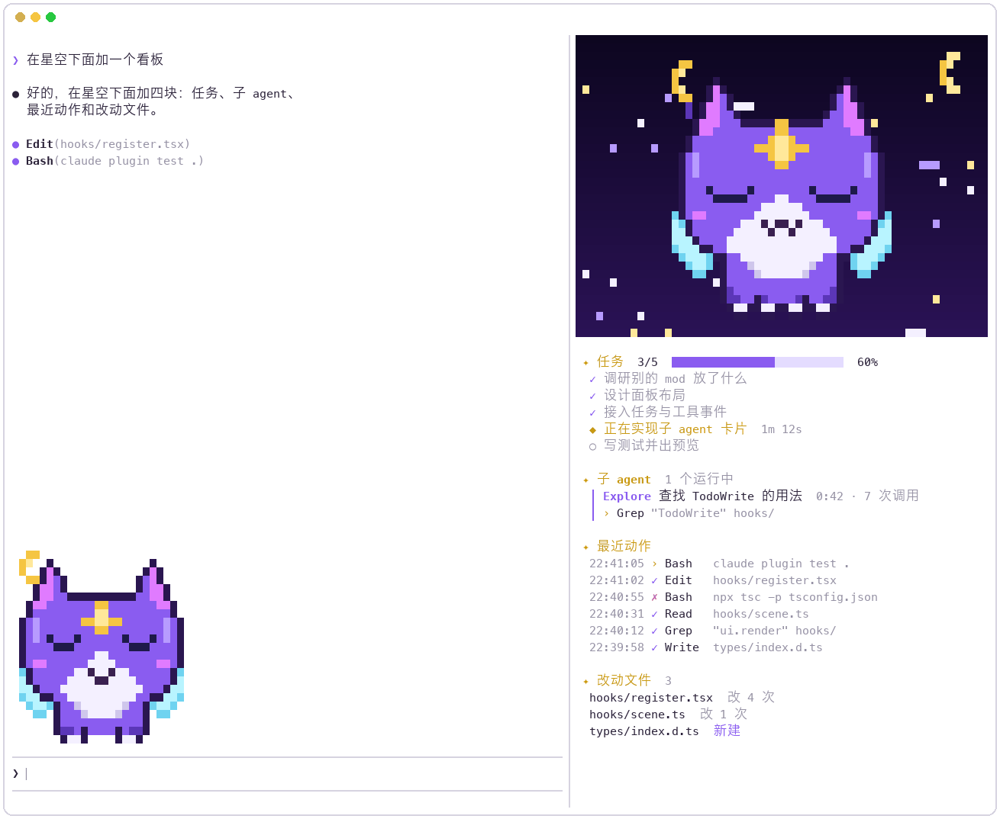

<div align="center">


### 一只住在 Claude Code 里的像素猫，顺便帮你盯着整个会话。

<p>
  <a href="https://code.claude.com/docs/en/plugins/mods/create"></a>
  <a href=".claude-plugin/plugin.json"></a>
  <a href="LICENSE"></a>
  <a href="https://github.com/muxia23/ricky-pixel-mod/stargazers"></a>
</p>

<p>
  <a href="#-快速上手"><b>快速上手</b></a> ·
  <a href="#-功能"><b>功能</b></a> ·
  <a href="#-表情"><b>表情</b></a> ·
  <a href="#%EF%B8%8F-选项"><b>选项</b></a> ·
  <a href="#-常见问题"><b>常见问题</b></a> ·
  <a href="README.en.md"><b>English</b></a>
</p>



</div>

https://github.com/user-attachments/assets/81b3f878-c860-4d3a-ad5b-624ac57eeeb6

<br>

Ricky 在对话旁边闪烁的星空里飞，跟着 Claude 的状态变表情：**思考**时闭眼、额头星星发光，**调用工具**时扇翅膀撒星尘，**完成**时眯眼笑，**出错**时炸毛。星空下面是一块看板：任务进度、运行中的子 agent、最近的工具调用，以及你改过的文件。

## 🚀 快速上手

**1. 克隆**

```bash
git clone https://github.com/muxia23/ricky-pixel-mod ~/ricky-pixel-mod
```

**2. 加载**：只在本次会话加载：

```bash
claude --plugin-dir ~/ricky-pixel-mod
```

或者每次启动都加载，在 `~/.claude/settings.json` 里加：

```json
{ "env": { "CLAUDE_CODE_PLUGIN_DIRS": "~/ricky-pixel-mod" } }
```

**3. 切到全屏渲染**：在 Claude Code 里输入：

```
/tui fullscreen
```

> [!IMPORTANT]
> 侧边面板只有在**全屏渲染**下、终端宽度 **≥ 110 列**时才会停靠在对话右侧；默认渲染模式下它会显示在输入框上方。这个设置会被记住，只需要切一次；想切回来用 `/tui default`。

**4. 打个招呼**：终端够宽时面板会自动打开，也可以随时输入 `/ricky`。

> [!NOTE]
> 需要 Claude Code **2.1.287+**（支持 mods），终端需要支持**真彩色**（Ghostty、iTerm2、WezTerm、Kitty、VS Code 等）。

## ✨ 功能

<table>
<tr>
<td width="50%" valign="top">

### 🌌 星空面板
横向铺满面板的像素星空，星星闪烁，金色月牙，32×32 的 Ricky 会上下浮动、眨眼、飞行。

</td>
<td width="50%" valign="top">

### 📋 会话看板
**任务**进度条 · 运行中的**子 agent** 和它正在做什么 · 最近 6 次**工具调用**（✓ / ✗）· **改动文件**。没有内容的块自动隐藏。

</td>
</tr>
<tr>
<td width="50%" valign="top">

### 🐾 输入框上方横栏
小号 Ricky，Claude 工作时拖着星尘来回飞。它会**根据剩余空间自动选大小**：24 像素、16 像素，或者只露一个 8 像素的头，窗口再小也不会被截断。

</td>
<td width="50%" valign="top">

### 💜 紫金主题
加载提示变成「Ricky 摘星中…」，每个回合结束显示「✦ Ricky 陪你施法了 12s」。支持中英文。

</td>
</tr>
</table>

## 🐱 表情

<div align="center">

</div>

| Claude 在… | Ricky… |
| --- | --- |
| 空闲 | 悬停，慢慢扇翅膀，偶尔眨眼 |
| 思考 | 闭眼，额头星星发光 |
| 调用工具 | 快速扇翅膀，撒星尘 |
| 完成 | 眯眼笑 |
| 出错 | 瞪眼炸毛 |

## ⚙️ 选项

在 `/config` 里找到 *ricky-pixel-mod* 下的选项，或者在 `~/.claude/settings.json` 里设置：

```json
{ "pluginConfigs": { "ricky-pixel-mod": { "options": { "language": "zh", "bandSize": "small" } } } }
```

| 选项 | 可选值 |
| --- | --- |
| **`language`** | `en`（默认）English · `zh` 简体中文 |
| **`bandSize`** | `auto`（默认）自动选能放下的最大尺寸 · `large` / `medium` / `small` 最大 24 / 16 / 8 像素 · `off` 关闭横栏 |

## 🎨 打造你自己的 Ricky

Ricky 就是一段纯文本：[`tools/sprites.py`](tools/sprites.py) 里每一帧只画左半边，自动镜像，一个字母就是一个像素。改几个字母，然后：

```bash
python3 tools/sprites.py   # 需要 Pillow → 生成 hooks/sprites.ts 和 docs/ 预览图
python3 tools/banner.py    # 重画封面
```

用 `--plugin-dir` 加载时，保存文件后 Claude Code 会自动热重载。

## ❓ 常见问题

<details>
<summary><b>面板出现在输入框上方，不在侧边。</b></summary>
<br>
输入 <code>/tui fullscreen</code>，并把终端拉宽到至少 110 列。宽度不到 144 列时面板不会自动打开，用 <code>/ricky</code> 打开。
</details>

<details>
<summary><b>颜色不对，或者是一块一块的。</b></summary>
<br>
终端需要支持真彩色（24 位色），大多数现代终端都支持。
</details>

<details>
<summary><b>横栏太占地方。</b></summary>
<br>
默认已经会根据空间自动缩小。想一直保持小号，在 <code>/config</code> 里把 <code>bandSize</code> 设成 <code>small</code>（或 <code>off</code> 关闭）；只想临时收起，按 <code>ctrl+x ctrl+a</code>。
</details>

<details>
<summary><b>怎么清空看板？</b></summary>
<br>
<code>/clear</code> 开启新对话时会一起清空。
</details>

## 🛠 开发

```bash
claude plugin validate .   # 查看引擎看到了什么、会拒绝什么
claude plugin test .       # 运行 hooks/*.test.tsx 里的测试
```

## 📜 授权与声明

- **代码**：[MIT](LICENSE)。
- **Ricky 的形象**（`tools/sprites.py`、`hooks/sprites.ts` 中的像素数据和 `docs/` 中的图片）：灵感来自 VALORANT 的一款皮肤角色，属于同人作品，**不在 MIT 授权范围内**，仅可按 Riot Games 粉丝内容政策非商业使用。详见 [LICENSE](LICENSE)。

<sub>Ricky Pixel Mod was created under Riot Games' "Legal Jibber Jabber" policy using assets owned by Riot Games. Riot Games does not endorse or sponsor this project.</sub>

<div align="center">
<br>

**如果 Ricky 让你的终端变得可爱了一点，点个 ⭐ Ricky 会很开心。**

</div>
